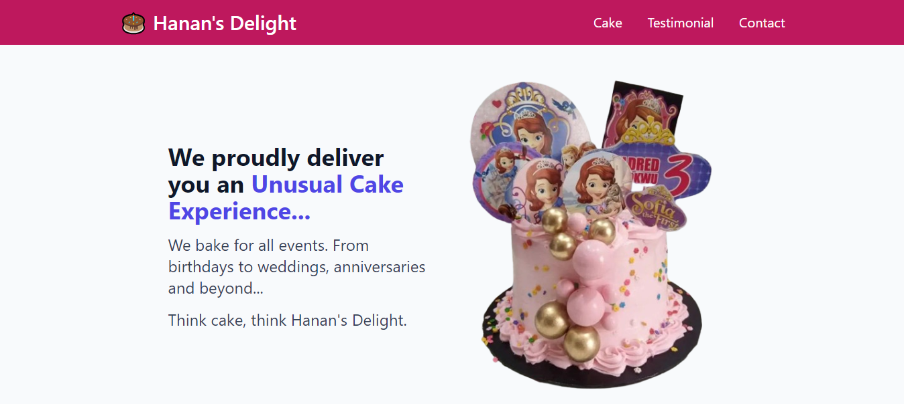
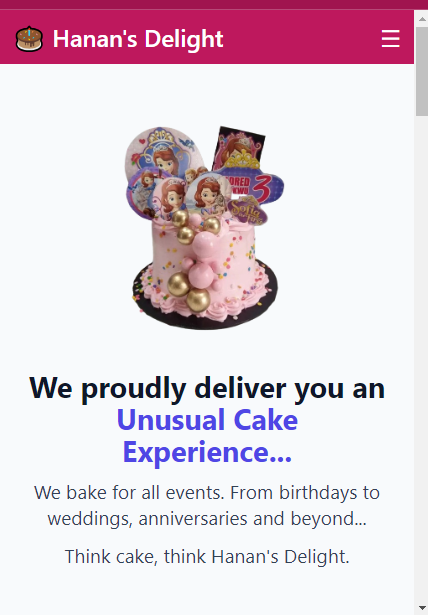
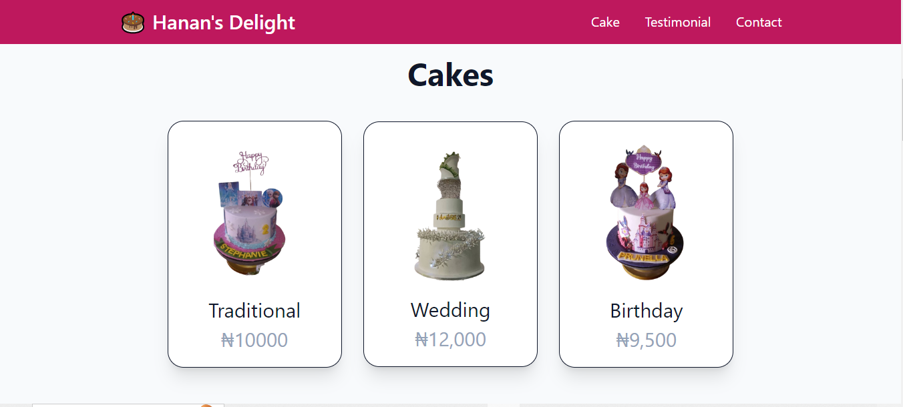
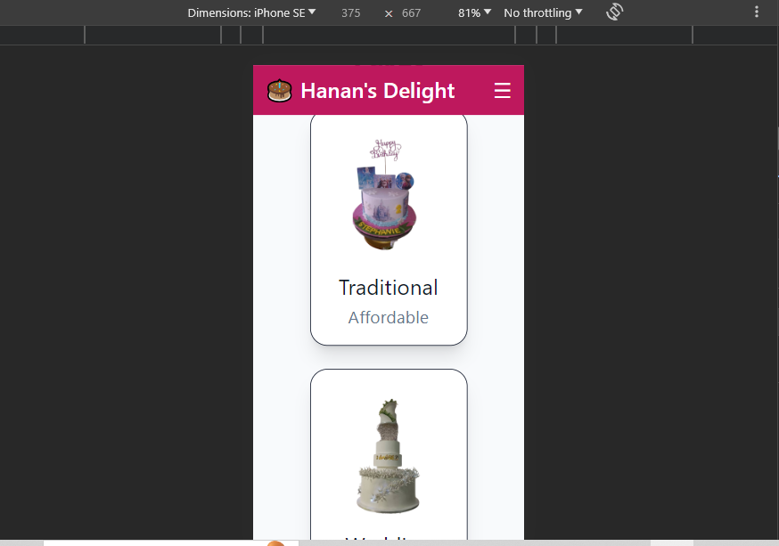
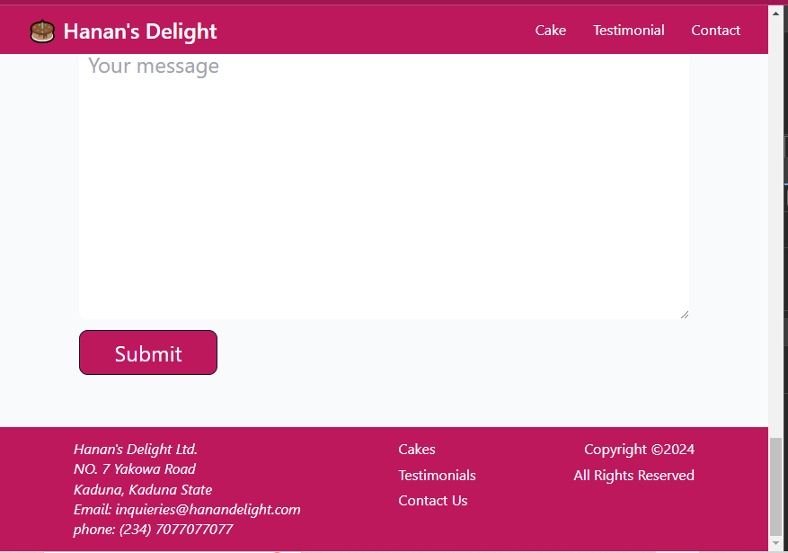

# firstTailwind-landing

This is a single-page website project showcasing delicious cakes. The project is built using Tailwind CSS and includes a responsive design with a hamburger menu and dropdown feature. This is been design to 

## Table of Contents

- [Demo](#demo)
- [Features](#features)
- [Getting Started](#getting-started)
- [Screenshots](#screenshots)
- [Usage](#usage)
- [Customization](#customization)
- [Contributing](#contributing)
- [License](#license)

## Demo

You can view a live demo of the Cake Delights website at [...]

## Features

- Responsive design for various screen sizes.
- Hamburger menu for mobile navigation.
- Dropdown feature for easy access to different cake categories.

## Getting Started

To get a copy of this project up and running on your local machine, follow these steps:

1. Clone the repository:

   ```bash
   git clone https://github.com/Mogle7Arkad/firstTailwind-landing.git

2. Change into the project directory: cd 
3. Install dependencies: npm install
4. Start the development server: npm run dev
5. Open liveserver.

## Screenshots

### Dashboard
The below screenshot shows the dashboard of the app, containing the header/navigation bar and the hero section of the app. The first screenshot shows it on a large screen while the second and third screenshots shows the app responsive state to smaller screen sizes






### Body
The below screenshots shows selected aspect of the body of the app on a large screen and on a smaller screen respectively





### Footer
The below screenshots also shows the footer of the app.



## Usage

Feel free to use this project as a template for your own cake-related websites or modify it to suit your needs. Customize the content, images, and styles to make it unique.

## Customization

If you want to customize the design or add more features, here are the main files to look into:

- index.html: Update the content and structure of your homepage.
- styles/main.css: Customize the styles using Tailwind CSS classes.
- Other files as needed for additional pages or features.

## Contributing

If you'd like to contribute to the project, please follow these steps:

- Fork the repository.
- Create a new branch for your feature or bug fix.
- Make your changes and submit a pull request.

## License

This project is licensed under the MIT License.